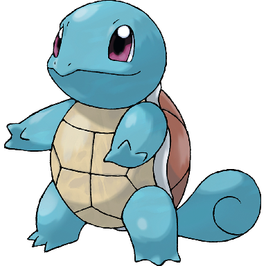
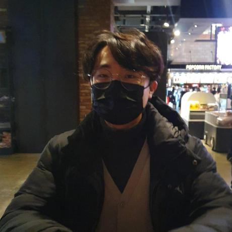
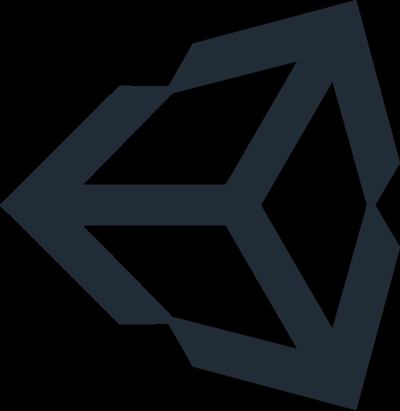

# :ocean: HICC 개발 프로젝트
이 프로젝트는 HICC 동아리원들이 개발 프로젝트 경험을 쌓을 수 있게 해주는 프로젝트입니다.

졸업한 동아리 선배나 프로젝트 경험이 풍부한 고학년 선배들이 멘토로 참여해서 좋은 프로젝트 경험을 쌓도록 도와줍니다.

# :mortar_board: 멘토 소개
<table>
  <!-- Mentore Image -->
  <tr style="background-color:#fff">
    <td colspan="2" style="text-align:center">
      
    </td>
    <td colspan="2" style="text-align:center">
      
    </td>
    <td colspan="2" style="text-align:center">
      
    </td>
  </tr>
  <!-- Mentor Name -->
  <tr style="background-color:#fff">
    <td class="text-center" style="text-align:center">
      이름
    </td>
    <td class="mentor-name" id="lai-khan" style="text-align:center;color:#f00">
      Lai_Khan
    </td>
    <td class="text-center" style="text-align:center">
      이름
    </td>
    <td class="mentor-name" id="guardian_demon">
      Guardian_demoN
    </td>
    <td class="text-center" style="text-align:center">
      이름
    </td>
    <td class="mentor-name" id="guardian_demon">
      brandon
    </td>
  </tr>
  <!-- Mentor Position -->
  <!-- Main Field -->
  <tr style="background-color:#fff">
    <td  class="text-center" style="text-align:center">
      주요 분야
    </td>
    <td  class="text-center" style="text-align:center">
      BE
    </td>
    <td  class="text-center" style="text-align:center">
      주요 분야
    </td>
    <td  class="text-center" style="text-align:center">
      FPGA, PLC, MCU, Python 외
    </td>
    <td  class="text-center" style="text-align:center">
      주요 분야
    </td>
    <td  class="text-center" style="text-align:center">
      FE / BE
    </td>
  </tr>
  <tr style="background-color:#fff">
    <td colspan="2" style="text-align:center">
      
    </td>
    <td colspan="2" style="text-align:center">
      
    </td>
  </tr>
  <tr style="background-color:#fff">
    <td class="text-center" style="text-align:center">
      이름
    </td>
    <td class="mentor-name" id="puterism">
      Puterism
    </td>
    <td class="text-center" style="text-align:center">
      이름
    </td>
    <td class="mentor-name" id="puterism">
      조민기
    </td>
  </tr>
  <tr style="background-color:#fff">
    <td  class="text-center" style="text-align:center">
      주요 분야
    </td>
    <td  class="text-center" style="text-align:center">
      FE
    </td>
    <td  class="text-center" style="text-align:center">
      주요 분야
    </td>
    <td  class="text-center" style="text-align:center">
      게임, 클라이언트
    </td>
  </tr>
</table>

# :clapper: 프로그램 상세

### ☕ 커피챗
현직 개발자로 있는 HICC 선배들과 만나 자유롭게 대화할 수 있는 프로그램 입니다.

관심있는 분야나 공부, 기술, 진로 등 궁금한 것에 대해 물어보고 또 조언을 얻을 수 있습니다.

### 🏕️ 부트캠프
평소에 만들어 보고 싶었던 서비스를 기획부터 설계, 개발, 배포까지 일련의 과정을 경험해 볼 수 있습니다.

총 기간은 약 한 달 정도이며, 그 중 2주 동안 개발을 하게 됩니다. 개발을 마치면 발표를 통해 각자의 결과물을 공유하는 시간을 가집니다.

# :heavy_check_mark: 참가조건

### 공통
- 학습의지가 있는 사람이어야 합니다.
  - 현재 얼마나 알고 있는지는 중요하지 않습니다. 모르는 게 있으면 스스로 학습하고자 하는 의지가 중요합니다!
  - 스스로 학습하는 방법을 알고 있어야 합니다.
- 개인 or 팀이든 최소 1명 이상 동아리원이어야 합니다.
  - 대신 동아리원인 사람이 이름만 올리는 경우는 안 됩니다.
- 참여 태도가 불성실할 시, 다음부터 프로그램 참가가 제한될 수 있습니다.

### ☕ 커피챗
- 개발 관련해서 현직자에게 물어보고 싶은 것이 있는 사람
- 개발에 관심이 많은데 물어볼 곳이 없는 사람
- 진로나 공부에 대한 고민이 있는 사람
- 프로그래밍을 통해 무언가 만들고 싶은 게 있는 사람
- 이 밖에도 개발에 관심이 있다면 누구나 자유롭게 참가 가능합니다!

### 🏕️ 부트캠프
- 만들고 싶은 것이나 관심분야가 확실한 사람
- 해당 서비스를 개발할 역량이 있는 사람

# :raised_hand_with_fingers_splayed: Q&A
궁금한 점이 있으시다면 [issue탭](https://github.com/HICC-Official/Common/issues)에 질문을 올려주세요!

### 규칙
- 질문하기 전에 Notion 소개 페이지나 issue탭을 한 번 봐주세요. 관련 내용이 있을지도 모릅니다.
- 질문을 삭제하지 말아주세요. 답변자의 노고가 사라집니다.
- 궁금증이 해결되셨으면 close 버튼을 눌러주세요.

# :earth_asia: Notion 소개 페이지
[Notion 소개 페이지 Go! Go!](https://www.notion.so/HICC-3b4f73106d7441e6b2e5d38db3943ad9)
